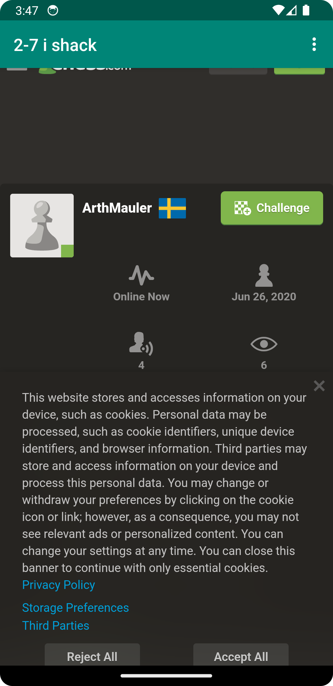
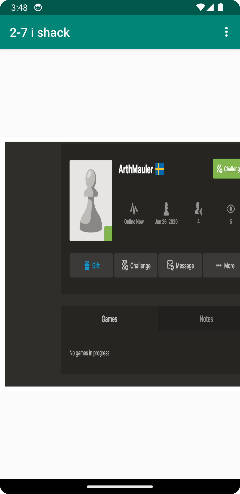

# Rapport

### steg 1

först döper om appnamet under strings.xml:

```
<string name="app_name">2-7 i shack</string>
```
* bytte TextView till "Webview" i activity_main.xml
* Under Webview lades till 

> <uses-permission android:name="android.permission.INTERNET" />


för internet under AndroidManifest.xml och 
> android:id="@+id/my_webview"

under activity.xml för ID

### steg 2

```
//skapar class för WebView
private WebView myWebView;
    
    public void showExternalWebPage(){
        myWebView.loadUrl("https://www.chess.com/member/arthmauler");
    }

    public void showInternalWebPage(){
        myWebView.loadUrl("file:///android_asset/about.html");
    }

    @Override
    protected void onCreate(Bundle savedInstanceState) {
        super.onCreate(savedInstanceState);
        setContentView(R.layout.activity_main);
        Toolbar toolbar = findViewById(R.id.toolbar);
        setSupportActionBar(toolbar);

        myWebView = findViewById(R.id.my_webview);
        myWebView.setWebViewClient(new WebViewClient());
        myWebView.getSettings().setJavaScriptEnabled(true);
```

### steg 3 - ladda in external och internal web view med knapp 





